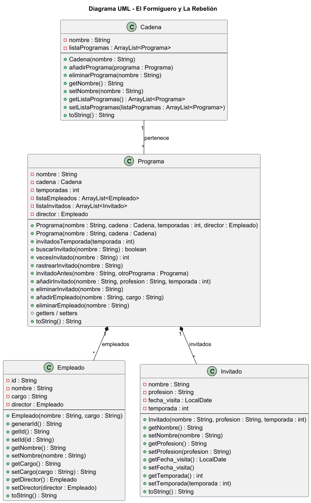

# Práctica 1 – El Formiguero y La Rebelión

## Descripción del proyecto

Este proyecto consiste en el desarrollo de una aplicación en Java que permite gestionar información relacionada con programas de televisión, sus cadenas, empleados e invitados.

La aplicación surge a partir de la práctica propuesta en clase, donde se busca modelar mediante programación orientada a objetos la relación entre distintos programas televisivos, sus trabajadores y los invitados que acuden a ellos en diferentes temporadas.

---

## Estructura del proyecto

El proyecto está compuesto por las siguientes clases:

- **Cadena**
- **Programa**
- **Empleado**
- **Invitado**

Cada una de ellas representa una entidad del mundo real y se relacionan entre sí según lo indicado en el enunciado de la práctica.

---

## Clase `Cadena`

Representa una cadena de televisión.

### Atributos principales
- `nombre`: nombre de la cadena.
- `listaProgramas`: lista de programas asociados a la cadena.

### Funcionalidades
- Añadir programas a la cadena.
- Eliminar programas por nombre.
- Mostrar la información completa de la cadena.

---

## Clase `Programa`

Representa un programa de televisión concreto.

### Atributos principales
- `nombre`: nombre del programa.
- `cadena`: cadena a la que pertenece.
- `temporadas`: número de temporadas del programa.
- `listaEmpleados`: empleados que trabajan en el programa.
- `listaInvitados`: invitados que han acudido al programa.
- `director`: empleado que ejerce como director del programa.

### Funcionalidades
- Añadir y eliminar empleados.
- Añadir y eliminar invitados.
- Mostrar invitados por temporada.
- Buscar si un invitado ha acudido al programa.
- Contar cuántas veces ha acudido un invitado.
- Rastrear la información completa de un invitado (fechas y temporadas).
- Comparar en qué programa estuvo antes un invitado.

---

## Clase `Empleado`

Representa a un empleado que trabaja en un programa.

### Atributos principales
- `id`: identificador único del empleado.
- `nombre`: nombre del empleado.
- `cargo`: puesto que desempeña (director, técnico, presentador o colaborador).
- `director`: referencia al director del programa (si procede).

### Consideraciones
- El identificador se genera automáticamente.
- Si el cargo introducido no es válido, se asigna el valor `"pte"`.

---

## Clase `Invitado`

Representa a una persona invitada a un programa.

### Atributos principales
- `nombre`: nombre del invitado.
- `profesion`: profesión del invitado.
- `fecha_visita`: fecha en la que acudió al programa.
- `temporada`: temporada en la que fue invitado.

### Consideraciones
- La fecha de visita se solicita al usuario en el momento de crear el invitado.
- Se utiliza la clase `LocalDate` para la gestión de fechas.

---

## Relaciones entre clases

- Un **Programa** pertenece a una **Cadena**, y una cadena puede tener varios programas.
- Los **Empleados** y **Invitados** están asociados a un **Programa**.
- Si un programa deja de existir, también desaparecen sus empleados e invitados asociados.

---

## Diagrama UML

A continuación se muestra el diagrama UML que representa las clases del proyecto y sus relaciones:

---

## Plan de pruebas

Durante el desarrollo del proyecto se han realizado distintas pruebas para comprobar el correcto funcionamiento del programa:

- Creación de cadenas y programas.
- Inserción y eliminación de empleados.
- Inserción y eliminación de invitados.
- Consulta de invitados por temporada.
- Búsqueda y rastreo de invitados.
- Comparación de fechas de visita entre programas.

Todas las pruebas han dado resultados correctos.

---

## Conclusión

Con esta práctica se ha trabajado la programación orientada a objetos en Java, aplicando conceptos como clases, objetos, relaciones entre entidades, listas dinámicas y manejo de fechas.

El proyecto cumple con todos los requisitos solicitados en el enunciado y permite gestionar de forma correcta la información relacionada con programas de televisión.

