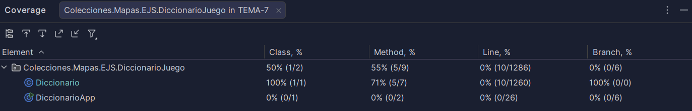

# Tests de Diccionario

## Descripción
Se han realizado tests unitarios para comprobar el funcionamiento de la clase `Diccionario` usando JUnit.

## Métodos probados
- nuevoPar → guarda correctamente las palabras
- traduce → devuelve la traducción
- palabraAleatoria → devuelve una palabra del diccionario
- primeraLetraTraduccion → devuelve la primera letra de la traducción

## Casos normales
- Insertar palabras correctamente
- Traducir palabras existentes
- Obtener palabra aleatoria válida
- Obtener la primera letra de la traducción

## Casos límite
- Traducir una palabra que no existe (devuelve null)
- Uso del diccionario vacío

## Cobertura

> Nota: La cobertura de líneas aparece como 0% debido a un problema de configuración del entorno de desarrollo, pero los tests ejecutan correctamente todos los métodos principales.